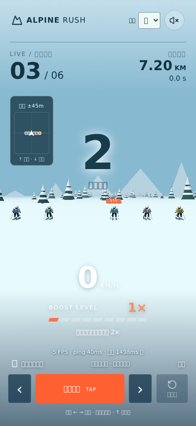
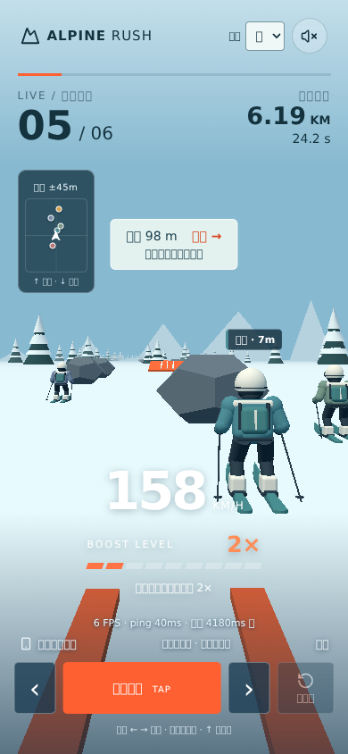
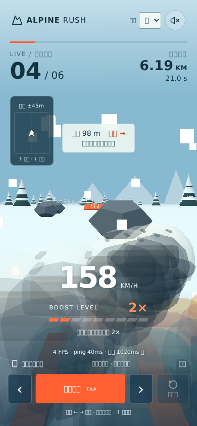
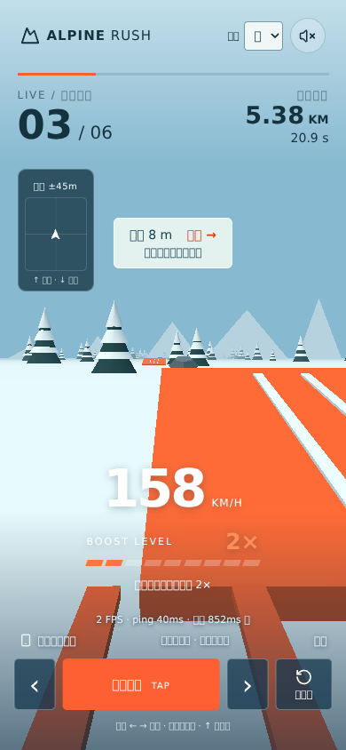

# 六人同場畫面與競賽感自測

2026-09-08 · 遊戲版本 v0.6.6（4a1ed17）。本次新增測試與報告，未修改正式玩法。

## 結論

目前可同場比時間，但更接近共享雪道的計時賽。沒有玩家碰撞本身不是問題；真正缺口是近距離重疊遮擋、永久升速使差距持續擴大，以及缺少跟滑、超車與追趕回饋。無須加入撞人減速才能改善。

## 實際畫面測試

六個獨立 Chromium 頁面，390×844、低畫質，使用正式 React / Three.js renderer，注入六人快照。測起跑、近距離群聚、重疊與分散，共 24 個視角檢查，WebGL 均可用、未記錄到 pageerror。

**這不是六支手機連線 Cloudflare 的壓測。** Transport / 票券 API 為 mock，資料 age 因固定快照而增加；軟體 GPU 並行六頁的 FPS 不可視為手機效能。測試環境缺繁體中文字型，因此截圖中的方框不是已確認的正式站文字問題。

| 情境 | 實測現象 | 判斷 |
|---|---|---|
| 起跑 | 第三位視角可見前方五人，雷達有五個對手點 | 有同場感，但人偶偏小；相同進度時名次按既有排序顯示 |
| 群聚／前後交錯 | 第三位視角可見近距離角色，僅一個姓名標籤；部分對手在側後方，只能靠雷達 | 能感受到有人，但對手身分、超車意義不明顯 |
| 多人重疊 | 大片半透明頭盔／身體及接觸特效蓋住雪道 | **需要修正**，目前透明化仍不足；不能視為近距離畫面已合格 |
| 分散 | 六個視角皆零雷達對手點、零姓名標籤 | 很容易覺得只剩自己滑；遠方模型即使在可見距離內也難辨識 |

### 起跑

### 群聚

### 多人重疊

### 分散

現有規則：雷達 ±45m，姓名只顯示前方 4–140m 且有畫面邊界／避讓限制，最多三個；模型在縱向差距 500m 內才顯示。因此雷達、標籤、模型不是同一個可见條件。玩家顏色以 ID hash 選六色，不保證六人各自不同色。

## 無障礙碰撞的物理模擬

採用正式 `step()`、seed 7，僅保留跳板以排除樹石碰撞。六人每 0.2 秒點擊，分別設定每座／每二座／…／每六座跳板嘗試成功。這是刻意控制的腳本情境，**不是人類成功率、手機延遲或實際遊玩統計**。

| 條件 | 完賽秒數 | 結果 |
|---|---|---|
| 六人每座跳板都成功 | 全部 43.8s | 幾乎重疊，共用同一條最優路線；彼此不影響 |
| 六種跳板成功頻率 | 43.8 / 46.2 / 49.8 / 53.4 / 57.0 / 60.6s | 第 20 秒領先者 2488m、最後一位 1322m，相差 1166m |

後一組未完賽玩家每秒取樣時，僅約 23.5% 的玩家樣本在 ±45m 內有其他未完賽玩家；不應將此數字外推成人類遊戲留存或競賽品質。

所有人 9× 後同速，已形成的差距沒有自然縮小機制。跳板沒有排他占用，沒有尾流／擋路／推擠／超車獎勵。DO 確實同步同一場比賽，但對手行為幾乎不改變你的決策或速度。

## 建議下一版（尚未實作）

1. 先修鏡頭附近的整個角色隱藏／淡出，以側邊方向提示取代穿模頭盔；加入固定六人進度條與前後差距、超車提示。
2. 保留無玩家碰撞，增加可讀的跟滑蓄力 → 離開尾流後短暫超車加速。即使 tier 已到 9×，也需讓雙方有短暫相對速度差；效果由 DO 計算。
3. 重新平衡永久九段升速的累積差距：優先考慮較短回合或分段賽，必要時測試明確、有上限的落後追趕資源，避免不透明地強行拉近位置。

## 重跑

- `node tests/six-player-simulation.mjs` 產生 simulation.json。
- 先執行 `npm run build`；另備 Playwright 與 Chromium，再執行 `node tests/six-player-visual.cjs`。可用 PLAYWRIGHT_MODULE、CHROMIUM_EXECUTABLE 指定測試依賴；不將它們加進遊戲正式依賴。
- visual-metrics.json 保留各視角姓名標籤與雷達點數。
